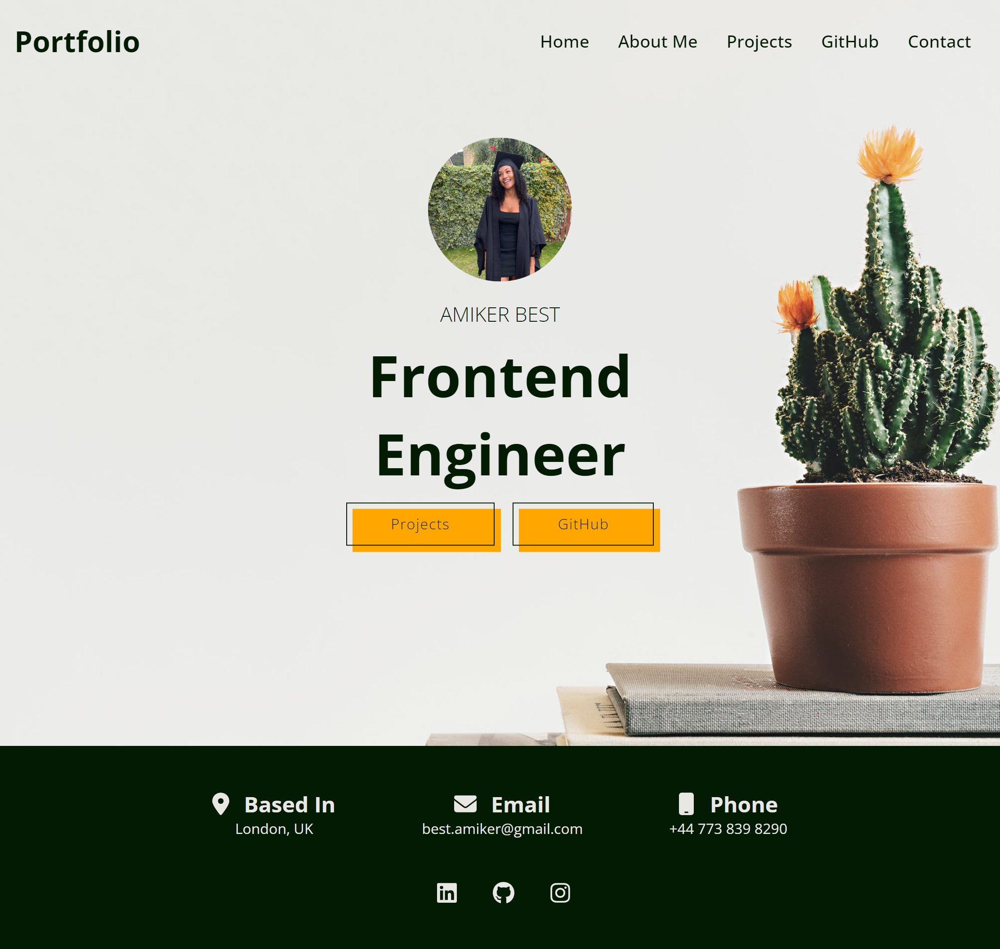

# Portfolio

Employing a mobile-first approach and leveraging the power of React, I crafted a sleek and intuitive [portfolio web application](https://amikerb.github.io/Portfolio/) to impress prospective employers. My application boasts a seamless navigation bar, a captivating home page, an in-depth About Me section complete with a link to my CV, a comprehensive portfolio of my other websites, and a dedicated contact page for easy communication.

## Screenshot of Application

## Credits 

- [Tech2 etc](https://www.youtube.com/watch?v=0h2b4ftbZcU&t=321s) youtube video
- Button design by Joe Bocock [button 52](https://getcssscan.com/css-buttons-examples) from CSS Scan.
- [Hero Image](https://www.pexels.com/photo/green-cactus-plant-on-pot-403571/)

